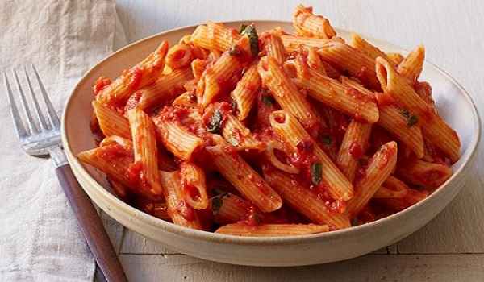

# MY FAVOURITE DISH

## _RED SAUCE PASTA_

>Recipe Servings: 2 &nbsp;&nbsp;  Prep Time: 10 mins
>
>Cook Time: 1 hr   &nbsp;&nbsp;   Total Cook Time: 1 hr 10 mins

## **About Red Sauce Pasta Recipe:**
 Delicious red sauce pasta, slow cooked in tangy tomato sauce. Served in a simple, authentic Italian way. This is a great recipe for brunch or to pack in your kids tiffin. Enjoyed immensely by adults and kids alike.

## INGREDIENTS

|**For the Tomato Sauce:**|**For the Pasta:**|
|-------------------------|------------------|
|1 Garlic clove           |110 gms pasta     |
|1 Onion                  |3 cups water      |
|1/2 cup water            |A pinch of salt   |
|1 Bay leaf               |
|1/2 tsp sugar            |
|4-5 Basil leaves         |
|1 tbsp onions, chopped   |
|1/2 tbsp garlic, chopped |
|to taste salt            |
|Oil (to saute)           |

|**For the Pasta:**|
|------------------|
|110 gms pasta|
|3 cups water|
|A pinch of salt|

## How to Make Red Sauce Pasta

**Prepare Sauce:**
1. Cook the tomatoes in a pan.
2. Add the clove of garlic, onion and bay leaf to it.
3. Add water and then season with salt and sugar.
4. Cover and let the tomatoes boil.
5. Cool and then grind to a puree.
6. Now in a separate pan, heat oil and add chopped onions and chopped garlic.
7. Add the tomato puree. Cook till its reduces to half.
8. Add basil leaves and keep aside.

**Prepare Pasta:**
1. Boil water with salt.
2. Add the pasta to it and let it boil. Drain when done
3. Transfer in a serving dish and serve with the tomato sauce.