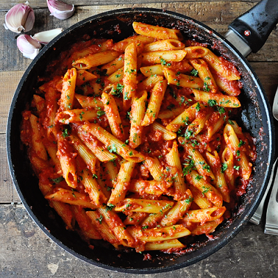

# MY FAVOURITE DISH

## _RED SAUCE PASTA_

>Recipe Servings: 2 &nbsp;&nbsp;  Prep Time: 10 mins
>
>Cook Time: 1 hr   &nbsp;&nbsp;   Total Cook Time: 1 hr 10 mins

## INGREDIENTS

|**For the Tomato Sauce:**|
---------------------------
|1 Garlic clove|
|1 Onion|
|1/2 cup water|
|1 Bay leaf|
|1/2 tsp sugar|
|4-5 Basil leaves|
|1 tbsp onions, chopped|
|1/2 tbsp garlic, chopped|
|to taste salt|
|Oil (to saute)|

|**For the Pasta:**|
--------------------
|110 gms pasta|
|3 cups water|
|A pinch of salt|

